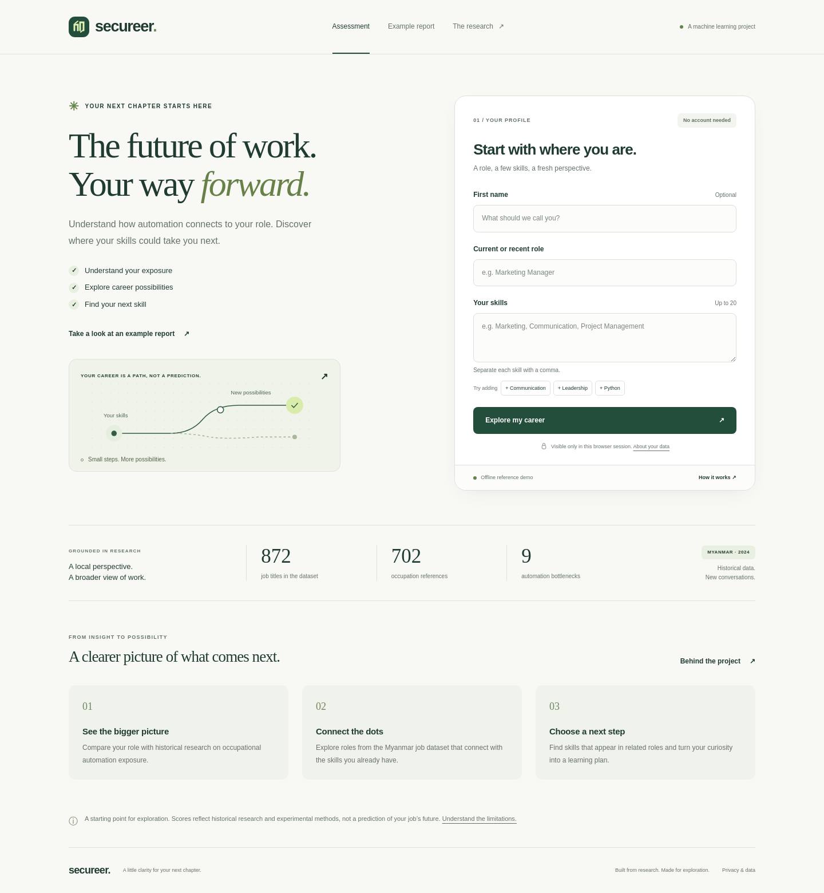
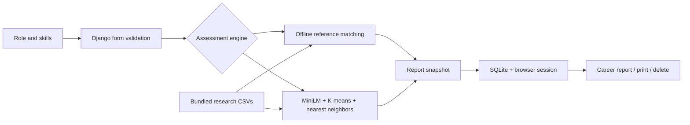

# Secureer

**A little clarity for your next chapter.**

Secureer connects automation exposure research with career exploration. Enter a role and a few skills to compare your occupation with historical references, discover related roles in Myanmar’s job market, and identify skills to develop.

Originally developed for the **AT82.03 Machine Learning** course at the **Asian Institute of Technology in 2024**, this portfolio edition brings the research into a complete, approachable web application.



## Explore the project

- **Assessment:** a short profile form with optional first name, skill suggestions, validation, and useful error messages.
- **Career report:** an explained exposure index, five related roles when matches exist, shared skills, and additional skills to explore.
- **Example report:** a public sample that works without submitting or storing personal information.
- **Research page:** the methodology, dataset provenance, interpretation limits, and data handling explained in plain language.
- **Responsive interface:** desktop and mobile layouts, keyboard access, reduced-motion support, and a print layout for saving reports as PDF.
- **Private report access:** personal reports belong to the browser session that created them and can be deleted from the results page.

## Try it locally

Use **Python 3.10 or later**. Python 3.12 is recommended if you also want to run the semantic ML mode.

From the repository directory:

```bash
python -m venv .venv
source .venv/bin/activate
python -m pip install -r requirements.txt
python manage.py migrate
python manage.py runserver
```

On Windows, activate the environment with `.venv\Scripts\activate`.

Open [localhost:8000](http://127.0.0.1:8000/). The [example report](http://127.0.0.1:8000/example/) is a quick way to see the result format.

The default **offline reference demo** needs no model download, API key, seeded database, or frontend build. It uses the three bundled CSV files and Python’s standard library for matching. Application data is stored in `var/db.sqlite3`; the original class-project database is not used.

### Docker

```bash
docker compose up --build
```

Open [localhost:8000](http://127.0.0.1:8000/). Compose binds to localhost and stores assessment data in a named volume. The image runs migrations at startup, serves static assets with WhiteNoise, and starts Gunicorn as a non-root user.

```bash
docker compose down
```

The named volume survives a normal shutdown.

## Demo and semantic ML modes

| | Offline reference demo | Semantic ML |
|---|---|---|
| Enable | Default: `SECUREER_ENGINE=demo` | `SECUREER_ENGINE=ml` |
| Title comparison | Normalized keyword overlap | MiniLM embeddings + 20 K-means clusters |
| Exposure index | Historical score of the closest occupation reference | Average of the occupation-cluster score and skill bottleneck distance |
| Career matching | Inverse-frequency weighted keyword cosine similarity | Five nearest neighbors in skill embedding space |
| First use | No downloads | Downloads MiniLM weights and fits the pipeline |
| Unknown titles | No score when the reference match is weak | Experimental semantic comparison |

The demo’s score depends on the title; skills affect its career suggestions. Both modes display an **index out of 100**, with its method identified on the report. Neither establishes a personal probability of job loss. See the [model card](docs/MODEL_CARD.md) for formulas and limitations.

### Run the semantic pipeline

In a Python 3.12 environment:

```bash
python -m pip install -r requirements-ml.txt
SECUREER_ENGINE=ml python manage.py runserver
```

For a smaller CPU-only installation on Linux, install PyTorch first:

```bash
python -m pip install torch==2.14.1 --index-url https://download.pytorch.org/whl/cpu
python -m pip install -r requirements-ml.txt
```

The first ML assessment can take longer while model weights download and 702 occupation titles and 872 skill descriptions are encoded. The fitted engine is reused within each server process. The homepage, example report, migrations, and saved reports do not require ML initialization.

The archived `recommender_model` was fitted on **878 rows**, while the bundled career CSV contains **872 rows**. Loading it against that CSV would misalign recommendation indices. The application therefore fits K-means and nearest neighbors directly on the current bundled rows, using the original algorithm choices. Archived pickle files remain research artifacts and are not loaded by the app.

The standard Docker image contains the offline demo dependencies. Build a separate image with the ML requirements if deploying semantic mode, and allow additional startup time and memory.

## How it is built



The web app uses **Django 5.2**, **SQLite**, and local **HTML, CSS, and JavaScript**. **Gunicorn** and **WhiteNoise** handle container serving. Optional ML dependencies are **sentence-transformers**, **scikit-learn**, **NumPy**, and **PyTorch**. The interface works without JavaScript; local enhancements add skill buttons, submission feedback, and printing.

```text
admin/                       Django settings and application entry points
risk_check/
  forms.py                   Profile validation and skill normalization
  services.py                Demo and semantic assessment engines
  views.py                   Assessment, report ownership, and deletion
  models.py                  Profiles, skills, and saved report snapshots
  templates/                 Landing page, report, research, and error pages
  static/risk_check/          Local styles, scripts, and branding
  tests.py                   Assessment and privacy regression coverage
ml_models/                   Bundled datasets and archived research models
docs/                        Model card, deployment guide, and screenshots
scripts/browser_smoke.py      Browser interactions and screenshot capture
.github/workflows/           Application CI and manual container publishing
```

## Research data

| File | Included records | Purpose |
|---|---:|---|
| `ml_models/df_processed.csv` | 872 job titles | MyJob career and skill examples prepared for the 2024 project |
| `ml_models/df_title_risk.csv` | 702 occupations | Frey and Osborne historical computerisation references |
| `ml_models/df_skill.csv` | 9 descriptions | O*NET automation bottleneck variables used in ML mode |

The data is a historical snapshot, and some titles and skill labels retain source inconsistencies. Career matches are examples rather than current vacancies. The original notebook documents the research process; its raw-data paths refer to the original development environment and are not required to run the app.

Original project materials:

- [Model development notebook](Job_Automation_Risk_Prediction.ipynb)
- [Academic report](Job_Automation_Risk_Prediction_and_job_recommender_system.pdf)
- [Presentation](Job_Automation_Risk_Prediction_and_job_recommender_system_presentation.pdf)
- [Original demo video](demo_vedio.mp4)

## Checks and screenshots

```bash
python manage.py check
python manage.py makemigrations --check --dry-run
python manage.py collectstatic --noinput
python manage.py test
```

The regression suite covers profile validation, deterministic demo results, unknown inputs, saved snapshots, session ownership, CSRF protection, escaped user content, report deletion, and the full 0–100 score range. CI runs the web suite on Python 3.10, 3.12, and 3.14 and builds the demo container.

To reproduce the desktop/mobile browser checks and screenshots, start the demo server in another terminal, then run:

```bash
python -m pip install playwright
python -m playwright install chromium
python scripts/browser_smoke.py
```

Set `SECUREER_URL` to use a different local port. The script checks the homepage, example, and research page at 320, 390, 768, and 1440 pixels, exercises the assessment flow with and without JavaScript, and deletes its sample assessments afterward.

[Desktop report](docs/images/report-desktop.png) · [Mobile landing page](docs/images/home-mobile.png)

## Configuration and deployment

Local development uses sensible defaults. For custom settings, copy `.env.example` and export its variables. Django itself does not automatically read `.env` files; Docker Compose reads `.env` for variable substitution.

```bash
cp .env.example .env
set -a
source .env
set +a
```

A public deployment needs a generated secret key, explicit allowed hosts, HTTPS settings, persistent storage, and a data retention policy. See the [deployment guide](docs/DEPLOYMENT.md) for the complete configuration.

GitHub Actions checks pushes and pull requests. The **Publish container** workflow runs manually and publishes to the repository’s GitHub Container Registry; it does not redeploy the former class-project hosting account.

## Project credits

Original academic team: **Kaung Nyo Lwin, Nyein Chan Aung, Phone Myint Naing, and Khin Yadanar Hlaing**. Submitted to **Dr. Chaklam Silpasuwanchai**, Asian Institute of Technology.

The original report credits **MyJob** for the Myanmar job data and **Frey and Osborne** and **O*NET** for the research framework. The portfolio edition retains the original materials and makes the application’s assumptions and behavior easier to inspect.
